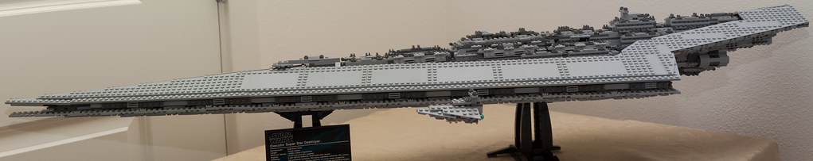
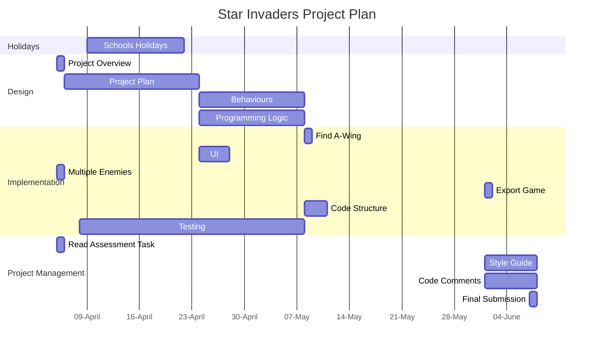

# Project Overview

This game is a simple "Space Invaders" clone. The theme of this game is Rebels vs Imperials.

The Rebels are in a A-Wing (the best star fighter) and the imperials are in an array of Imperial designed space craft.

## New Gameplay

### Player Weapons

The updated gameplay I'm adding is multiple weapons - lasers and proton bombs. The proton bombs have a 10 second cooldown before being able to be fired again. Lasers are infinite.

### Multiple enemy types

The tie fighter is the standard enemy star fighter. At regular intervals (to be defined upon testing) a super star destroyer will appear behind the other fighters and move from left->right or right->left and drop probe droids which target the player and explode.

# Behaviour - User Journey

# Planning Diagram - Project Plan

